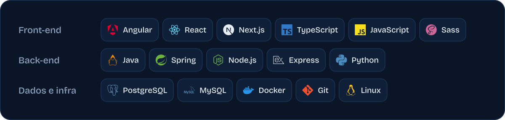
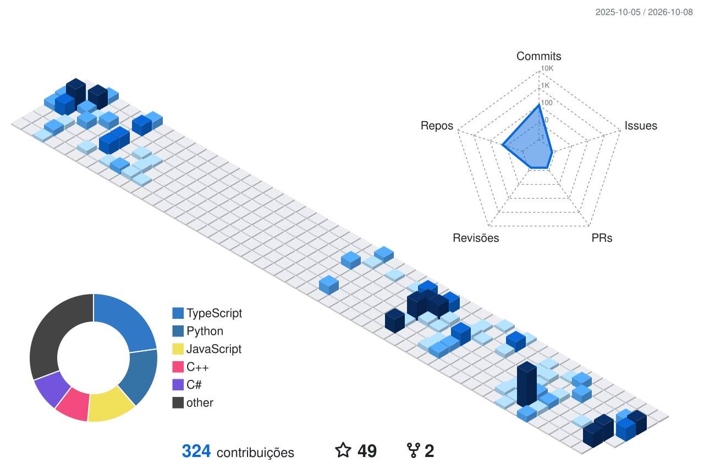

## Sobre mim

Desenvolvedor **fullstack** focado na construção de aplicações web e experiências digitais.

Trabalho principalmente com **Angular, React e TypeScript** no frontend, além de **Java/Spring e Node.js** no backend. Atualmente curso **Engenharia de Software na FIAP**, atuo profissionalmente com desenvolvimento de software e sou técnico em **Desenvolvimento de Sistemas pelo SENAI**.

## Portfólio

## Stack

## Atividade no GitHub

<picture>
  <source media="(prefers-color-scheme: dark)" srcset="./profile-3d-contrib/3d-dark.svg">
  
</picture>

  <picture>
    <source media="(prefers-color-scheme: dark)" srcset="./profile/stats-dark.svg">
    
  </picture>
  <picture>
    <source media="(prefers-color-scheme: dark)" srcset="./profile/streak-dark.svg">
    
  </picture>

<picture>
  <source media="(prefers-color-scheme: dark)" srcset="./profile/snake-dark.svg">
  
</picture>

## Contato

  &nbsp;
  

