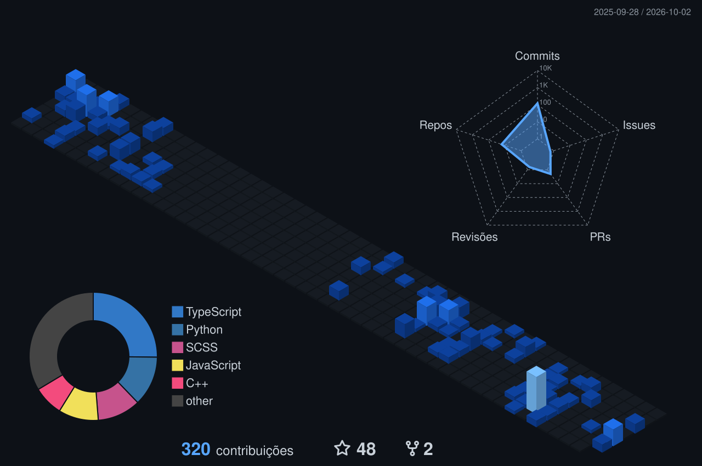

## Sobre mim

Desenvolvedor **fullstack** focado na construção de aplicações web e experiências digitais.

Trabalho principalmente com **Angular, React e TypeScript** no frontend, além de **Java/Spring e Node.js** no backend. Atualmente curso **Engenharia de Software na FIAP**, atuo profissionalmente com desenvolvimento de software e sou técnico em **Desenvolvimento de Sistemas pelo SENAI**.

## Portfólio

## Stack

## Atividade no GitHub

  
  

## Contato

  &nbsp;
  

